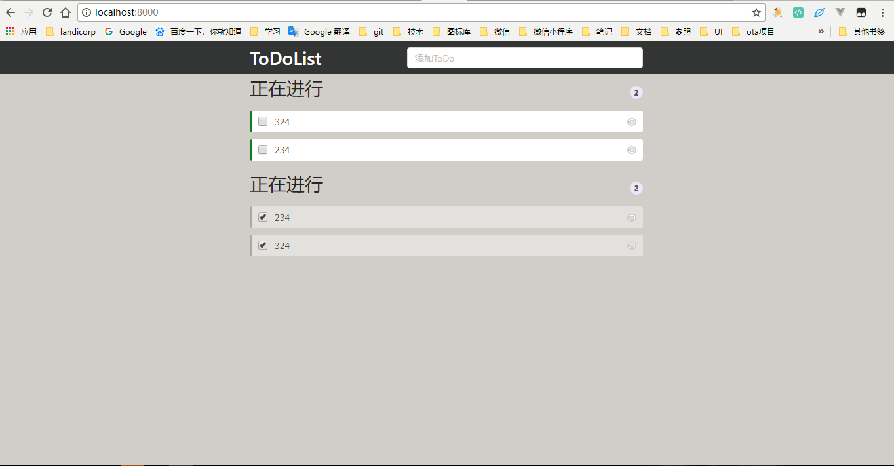

## 介绍
借antd学习react，写一个todolist小demo
## 安装
需要环境 nodejs, npm
* https://nodejs.org/en/ 下载安装node.js  如果已经安装略过
* npm install 安装依赖
* npm run start 启动
<!-- * 默认端口8000 访问地址：http://localhost:8000 -->
## 总结
1. 元素渲染
```jsx
    ReactDOM.render(<div>hello</div>,document.getElementById('root'))
```
2. 组件和属性
    * function组件
    * class组件
    * props属性
3. 状态和生命周期
>状态
```js
constructor(props) {
    super(props);
    this.state = {date: new Date()};
}
  ```
>状态设置
```js
this.setState({date:'2018-04-23'})
  ```
  ```js
this.setState((prevState,props)=>{
    // prevState 修改之前的state
    // props 组件的属性
    return {date:prevState.date}
})
  ```
4. 事件处理
    * 事件绑定this
```js
constructor(props) {
    super(props);
    this.state = {date: new Date()};
    this.handleLoginClick = this.handleLoginClick.bind(this);
}
  ```
5. 条件渲染

6. 列表和键
```js
const numbers = [1, 2, 3, 4, 5];
const listItems = numbers.map((number) =>
  <li key={number.toString()}>
    {number}
  </li>
);
```

## 效果图
