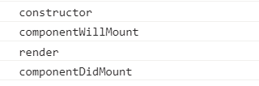
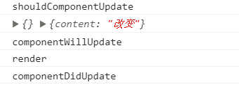

># 初始化执行顺序
+ constructor()
+ componentWillMount()
+ render()
+ componentDidMount()

## `constructor():构造函数`
* 执行时间：组件被加载前最先调用，并且仅调用一次
* 作用：定义状态机变量
* 注意：第一个语句必须是super（props），正确定义状态机
## `componentWillMount()`
* 执行时间：组件初始渲染（render()被调用前）前调用，并且仅调用一次
* 作用：如果在这个函数中调用setState改变某些状态机，react会等待setState完成后再渲染组件
* 注意：子组件也有componentWillMount函数，在父组件的该函数调用后再被调用
## `render()`
+ 执行时间：componentWillMount之后，componentDidMount之前，
+ 作用：渲染挂载组件
+ 触发条件：（1）初始化加载页面（2）状态机改变setState ( 3 ) 接收到新的props（父组件更新）
+ 注意：组件所必不可少的核心函数；不能在该函数中修改状态机state

## `componentDidMount()`

># state和props更新重新渲染执行顺序
+ shouldComponentUpdate(nextProps, nextState)
+ componentWillUpdate
+ render
+ componentDidUpdate

># 组件渲染后，当组件接收到新的props时被调用
## `componentWillReceiveProps(nextProps)`
+ 执行时间：组件渲染后，当组件接收到新的props时被调用；这个函数接收一个object参数（新的props）；props是父组件传递给子组件的。父组件发生render的时候子组件就会调用
+ 作用：渲染挂载组件；可以使用refs（备注：React支持一个特殊的属性，你可以将这个属性加在任何通过render()返回的组件中。这也就是说对render()返回的组件进行一个标记，可以方便的定位的这个组件实例。）
+ 注意：react初次渲染时，该函数并不会被触发，因此有时该函数需要和componentWillMount或componentDidMount组合使用;使用该函数一定要加nextProps参数，首次使用了解的可以先打印结果（console.log(nextProps)）

># 组件被卸载前调用
## `componentWillUnmount()`
+ 执行时间：组件被卸载前调用，
+ 作用：在该方法中执行任何必要的清理，比如无效的定时器，或者清除在 componentDidMount 中创建的 DOM 元素。